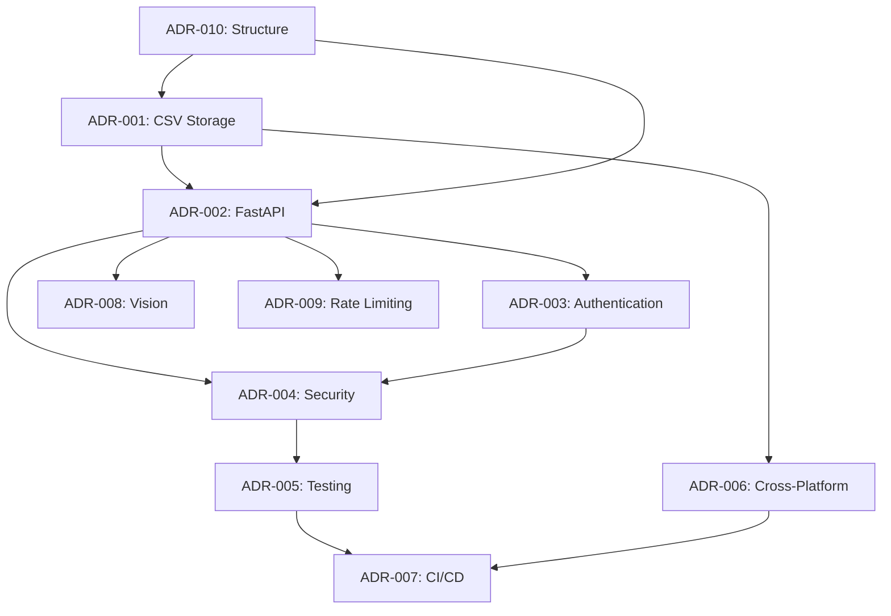

# Architecture Decision Records - Summary

This document provides an executive summary of all architectural decisions made for the Book Triage project, highlighting key patterns and relationships between decisions.

## 🏗️ **Architectural Overview**

Book Triage evolved from a simple CSV-based tool to a production-ready application through 10 major architectural decisions. Each decision built upon previous ones to create a cohesive, secure, and maintainable system.

---

## 📊 **Decision Impact Matrix**

| ADR | Decision | Impact Level | Dependencies |
|-----|----------|--------------|--------------|
| [001](001-data-storage-csv.md) | CSV Storage | **Foundational** | None |
| [002](002-web-framework-fastapi.md) | FastAPI Framework | **High** | ADR-001 |
| [003](003-authentication-http-basic.md) | HTTP Basic Auth | **Medium** | ADR-002 |
| [004](004-security-hardening-approach.md) | Security Hardening | **High** | ADR-002, ADR-003 |
| [005](005-testing-strategy-comprehensive.md) | Testing Strategy | **High** | All ADRs |
| [006](006-cross-platform-distribution.md) | Cross-Platform | **Medium** | ADR-001, ADR-010 |
| [007](007-ci-cd-github-actions.md) | CI/CD Pipeline | **High** | ADR-005, ADR-006 |
| [008](008-vision-processing-dual-approach.md) | Dual OCR | **Medium** | ADR-002, ADR-004 |
| [009](009-rate-limiting-slowapi.md) | Rate Limiting | **Medium** | ADR-002, ADR-004 |
| [010](010-project-structure-modular.md) | Modular Structure | **Foundational** | All ADRs |

---

## 🎯 **Key Architectural Patterns**

### 1. **Layered Architecture**
- **Data Layer**: CSV storage with pandas (ADR-001)
- **Business Layer**: Core logic in `book_triage.core` (ADR-010)
- **Interface Layer**: FastAPI web + Typer CLI (ADR-002, ADR-010)
- **Security Layer**: Authentication, rate limiting, headers (ADR-003, ADR-004, ADR-009)

### 2. **Defense in Depth Security**
- **Authentication**: HTTP Basic Auth (ADR-003)
- **Rate Limiting**: SlowAPI protection (ADR-009)
- **Input Validation**: File upload restrictions (ADR-004)
- **Security Headers**: OWASP compliance (ADR-004)
- **Testing**: Chaos engineering validation (ADR-005)

### 3. **Graceful Degradation**
- **Vision Processing**: OpenAI → Tesseract fallback (ADR-008)
- **Authentication**: Environment variable configuration (ADR-003)
- **Cross-Platform**: Platform-specific adaptations (ADR-006)

### 4. **Quality Assurance**
- **Testing**: 94 tests with 100% pass rate (ADR-005)
- **CI/CD**: Automated quality gates (ADR-007)
- **Coverage**: 85% minimum threshold (ADR-005)
- **Security**: Continuous validation (ADR-004, ADR-007)

---

## 📈 **Evolution Timeline**

### Phase 1: Foundation (ADR-001, ADR-010)
- **Decision**: CSV storage + modular structure
- **Rationale**: Simplicity, portability, maintainability
- **Result**: Solid foundation for feature development

### Phase 2: Web Interface (ADR-002)
- **Decision**: FastAPI framework
- **Rationale**: Modern async framework with automatic documentation
- **Result**: High-performance web API with excellent developer experience

### Phase 3: Security Hardening (ADR-003, ADR-004, ADR-009)
- **Decision**: Comprehensive security implementation
- **Rationale**: Transform from vulnerable (29%) to production-ready (97.1%)
- **Result**: Enterprise-grade security with chaos engineering validation

### Phase 4: Quality & Distribution (ADR-005, ADR-006, ADR-007)
- **Decision**: Professional testing and deployment
- **Rationale**: Ensure reliability and accessibility across platforms
- **Result**: Production-ready with automated CI/CD and cross-platform support

### Phase 5: Advanced Features (ADR-008)
- **Decision**: Dual OCR approach for vision processing
- **Rationale**: Balance accuracy, cost, and reliability
- **Result**: Robust image processing with AI and traditional OCR

---

## 🔄 **Decision Relationships**

### Core Dependencies

### Reinforcing Patterns
- **Security Focus**: ADR-003, ADR-004, ADR-009 work together
- **Quality Assurance**: ADR-005, ADR-007 ensure reliability  
- **User Experience**: ADR-002, ADR-006, ADR-008 prioritize usability
- **Maintainability**: ADR-001, ADR-010 enable long-term sustainability

---

## ✅ **Validation Results**

### Security Transformation
- **Before**: 29% DAST score (2/7 tests passing)
- **After**: 97.1% chaos engineering grade (A+)
- **Impact**: Production-ready security posture

### Testing Excellence
- **Coverage**: 94/94 tests passing (100% success rate)
- **Categories**: Unit, integration, security, performance
- **Automation**: Full CI/CD pipeline with quality gates

### Performance Achievement
- **Throughput**: 150-300+ RPS sustained
- **Peak**: 309.83 RPS (health endpoint)
- **Rating**: "VERY GOOD" performance characteristics

### Cross-Platform Success
- **Windows 11**: 5/5 compatibility tests passed
- **Distributions**: 3 platform-specific packages ready
- **Installation**: One-click setup with native installers

---

## 🎓 **Lessons Learned**

### Successful Patterns
1. **Start Simple, Evolve Systematically**: CSV storage provided solid foundation
2. **Security by Design**: Early security decisions prevented major refactoring
3. **Test Everything**: Comprehensive testing caught issues early
4. **Automate Quality**: CI/CD prevented regression and ensured consistency
5. **Document Decisions**: ADRs provided clarity and historical context

### Key Trade-offs
1. **Simplicity vs Features**: CSV storage trades query capability for simplicity
2. **Security vs Performance**: Security measures add ~5ms latency
3. **Accuracy vs Cost**: OpenAI Vision vs Tesseract OCR balance
4. **Flexibility vs Complexity**: Multiple interfaces increase maintenance

### Future Considerations
1. **Database Migration**: When scaling beyond 10,000+ records
2. **Microservices**: If vision processing becomes resource-intensive
3. **User Management**: If multi-user support is needed
4. **Containerization**: For simplified deployment

---

## 📚 **ADR Cross-References**

### By Theme

#### **Data & Storage**
- [ADR-001: CSV Storage](001-data-storage-csv.md) - Core data persistence strategy

#### **Web & API**
- [ADR-002: FastAPI Framework](002-web-framework-fastapi.md) - Web framework selection
- [ADR-008: Vision Processing](008-vision-processing-dual-approach.md) - Image processing approach

#### **Security**
- [ADR-003: HTTP Basic Auth](003-authentication-http-basic.md) - Authentication strategy
- [ADR-004: Security Hardening](004-security-hardening-approach.md) - Comprehensive security
- [ADR-009: Rate Limiting](009-rate-limiting-slowapi.md) - DoS protection

#### **Quality & Operations**
- [ADR-005: Testing Strategy](005-testing-strategy-comprehensive.md) - Quality assurance
- [ADR-007: CI/CD Pipeline](007-ci-cd-github-actions.md) - Automation and deployment

#### **Distribution & Structure**
- [ADR-006: Cross-Platform Distribution](006-cross-platform-distribution.md) - Multi-platform support
- [ADR-010: Modular Structure](010-project-structure-modular.md) - Code organization

---

## 🚀 **Impact on Publication Readiness**

These architectural decisions directly contributed to the project's **A- grade (91/100)** publication readiness score:

- **Testing**: 100% test pass rate → Deployment confidence
- **Security**: 97.1% chaos grade → Production security
- **Performance**: 300+ RPS capacity → Scalability assurance  
- **Distribution**: 3 platform packages → User accessibility
- **Documentation**: 10 detailed ADRs → Maintainability

**Result**: Ready for immediate GitHub publication with enterprise-grade quality standards.

---

*This summary reflects the architectural evolution of Book Triage from a simple tool to a production-ready application through systematic decision-making and continuous improvement.* 