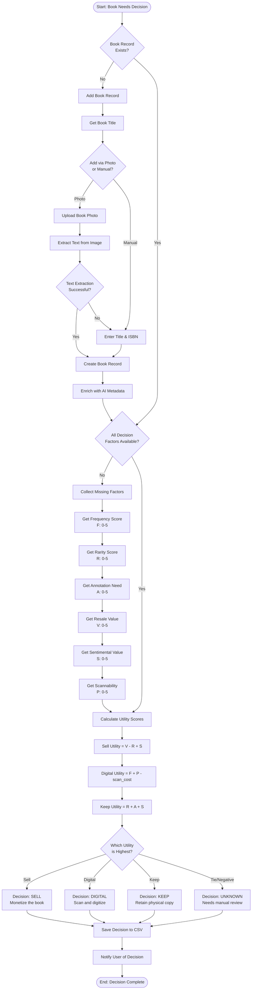
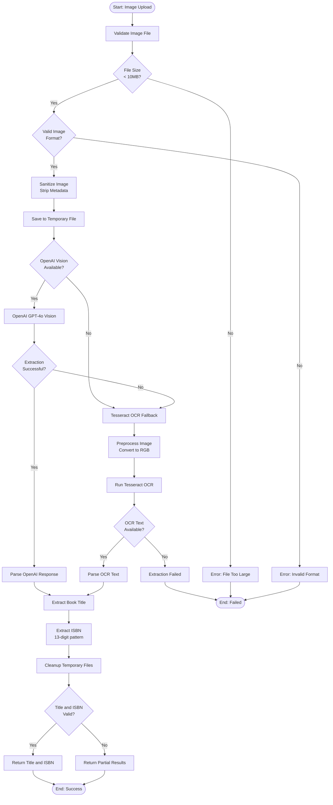
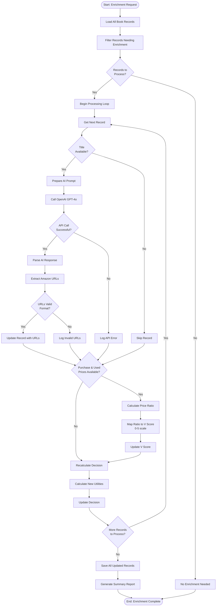
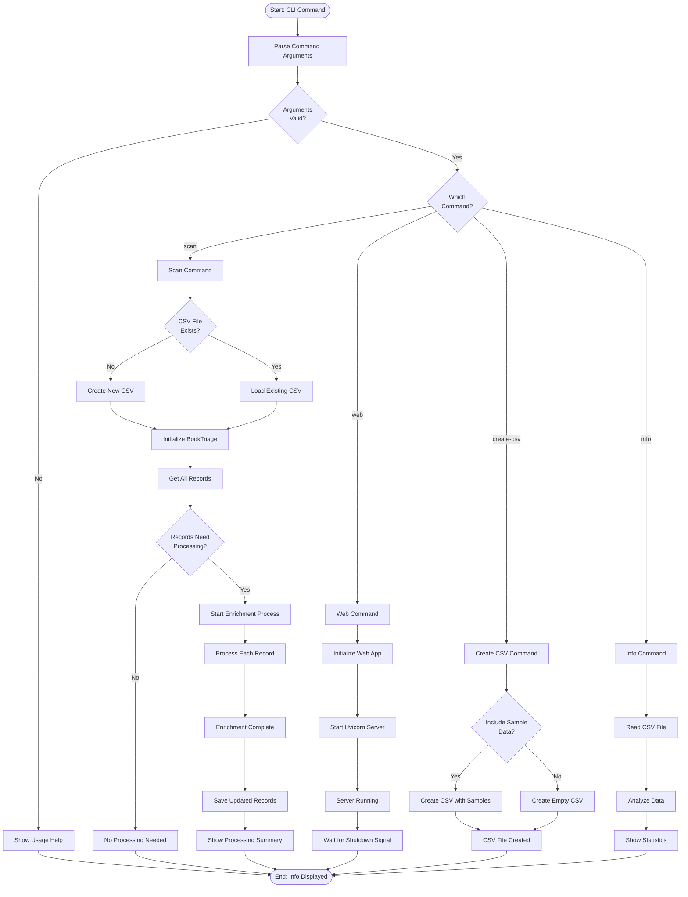
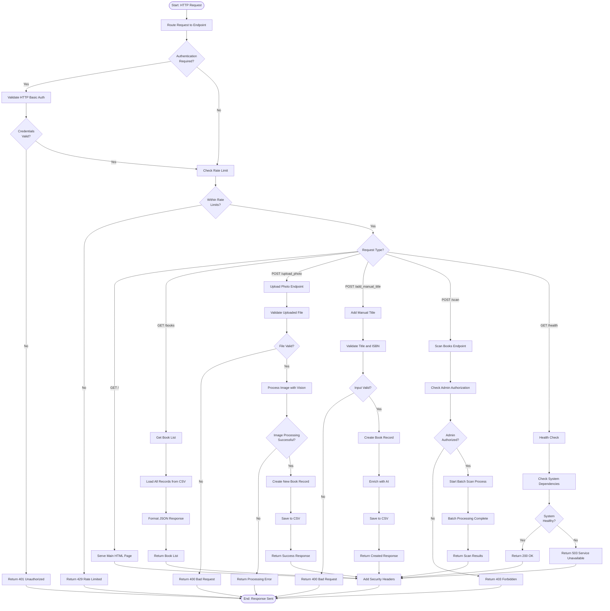

# Activity Diagrams - Book Triage System

This document contains activity diagrams that model the key business processes and workflows in the Book Triage application.

## 1. Book Triage Decision Workflow

This activity diagram shows the complete decision-making process for determining what to do with a book.

## 2. Vision Processing Pipeline

This activity diagram details the image processing workflow for extracting book information from photos.

## 3. AI Enrichment Process

This activity diagram shows how the system enriches book records with AI-powered metadata.

## 4. CLI Batch Processing Workflow

This activity diagram illustrates the command-line batch processing workflow.

## 5. Web Interface Request Processing

This activity diagram shows how web requests are processed through the FastAPI application.

## Key Process Characteristics

### 1. **Fault Tolerance**
- Multiple fallback strategies for image processing
- Graceful degradation when external services fail
- Comprehensive error handling and logging

### 2. **Security Integration**
- Authentication checks at request entry points
- Input validation for all user-provided data
- Rate limiting to prevent abuse

### 3. **Dual Processing Modes**
- Interactive web interface for single-book operations
- Batch CLI processing for bulk operations
- Shared core logic between interfaces

### 4. **AI-Enhanced Workflows**
- Primary AI processing with fallback mechanisms
- Enrichment processes that enhance but don't block core functionality
- Configurable AI service integration

### 5. **Data Consistency**
- Atomic operations for data updates
- CSV file integrity maintained throughout processes
- Validation at multiple process stages

### 6. **User Experience Focus**
- Clear feedback at each process step
- Progress indication for long-running operations
- Helpful error messages with recovery suggestions

These activity diagrams demonstrate the Book Triage system's robust, user-friendly workflows that balance automation with user control while maintaining data integrity and system reliability. 