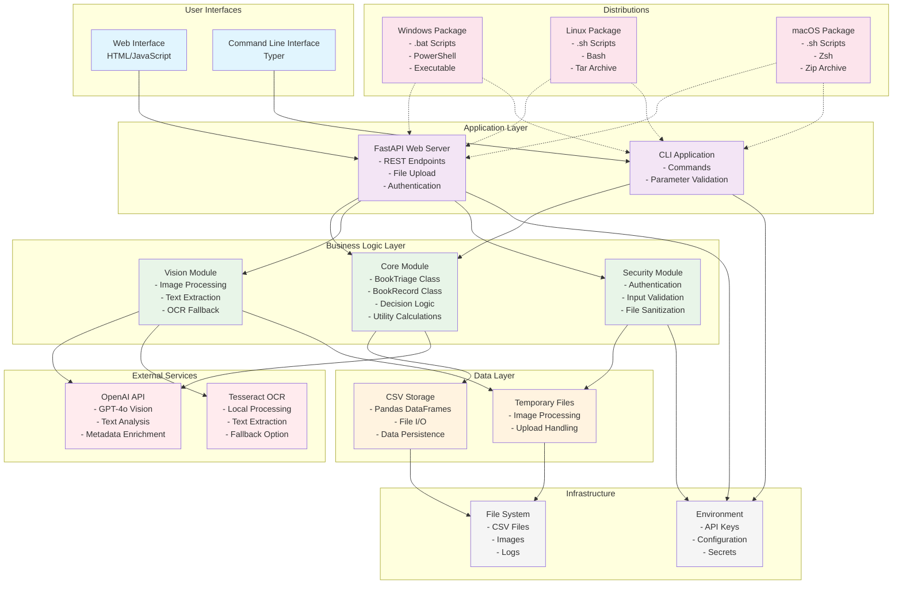

# Component Diagram - Book Triage System

This component diagram illustrates the high-level architecture of the Book Triage system, showing module boundaries, dependencies, and external integrations.



## Component Responsibilities

### User Interfaces
- **Web Interface**: Browser-based UI with drag-drop file upload, real-time book listing, and interactive editing
- **CLI**: Command-line tool for batch processing, automation, and headless operation

### Application Layer
- **FastAPI Web Server**: HTTP endpoints, request routing, middleware, authentication, and response formatting
- **CLI Application**: Command parsing, parameter validation, help system, and user feedback

### Business Logic Layer
- **Core Module**: Central business logic including decision algorithms, utility calculations, CSV operations, and AI enrichment
- **Vision Module**: Image processing pipeline with dual-strategy approach (OpenAI + Tesseract fallback)
- **Security Module**: Authentication (HTTP Basic), input validation, file sanitization, and security headers

### Data Layer
- **CSV Storage**: Persistent data storage using pandas DataFrames with type conversion and validation
- **Temporary Files**: Secure handling of uploaded images and processing artifacts

### External Services
- **OpenAI API**: GPT-4o Vision for image analysis, text extraction, and metadata enrichment
- **Tesseract OCR**: Local fallback for text extraction when OpenAI is unavailable

### Infrastructure
- **File System**: Cross-platform file operations, path handling, and storage management
- **Environment**: Configuration management, API key storage, and runtime settings

## Key Architectural Features

### 1. Layered Architecture
- Clear separation between presentation, application, business, and data layers
- Unidirectional dependencies flowing downward through layers

### 2. Plugin Architecture
- Vision processing supports multiple backends (OpenAI, Tesseract)
- Extensible design for adding new AI services or processing methods

### 3. Cross-Platform Support
- Platform-specific distribution packages
- Consistent behavior across Windows, Linux, and macOS
- Environment-aware configuration

### 4. Security Integration
- Security concerns handled at multiple layers
- Input validation, authentication, and sanitization
- Rate limiting and security headers

### 5. Dual Interface Design
- Web interface for interactive use
- CLI for automation and batch processing
- Shared business logic between interfaces

## Data Flow Patterns

### 1. Upload Flow
```
User → Web UI → API → Security → Vision → Core → CSV → File System
```

### 2. CLI Processing Flow
```
User → CLI → Core → Vision → OpenAI/Tesseract → CSV → File System
```

### 3. AI Enrichment Flow
```
Core → OpenAI API → Metadata Enhancement → CSV Update
```

## Integration Points

### External Service Integration
- **OpenAI**: REST API calls with authentication and error handling
- **Tesseract**: Local binary execution with image preprocessing

### File System Integration
- **CSV Files**: Primary data persistence mechanism
- **Image Files**: Temporary storage during processing
- **Configuration**: Environment-based settings management

### Cross-Platform Considerations
- **Path Handling**: Platform-agnostic file operations
- **Script Generation**: Platform-specific startup scripts
- **Dependency Management**: Platform-appropriate package bundling

This component architecture ensures modularity, testability, and maintainability while supporting the diverse requirements of the Book Triage application. 