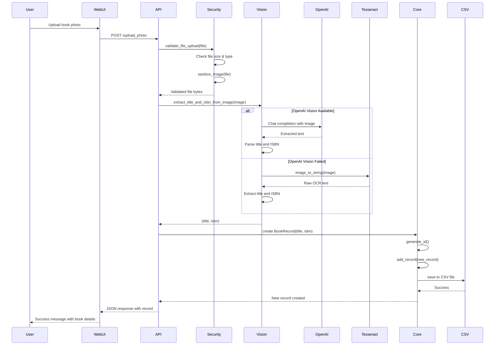
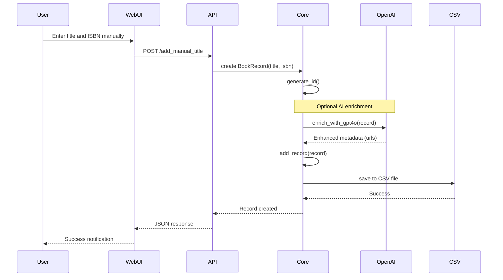
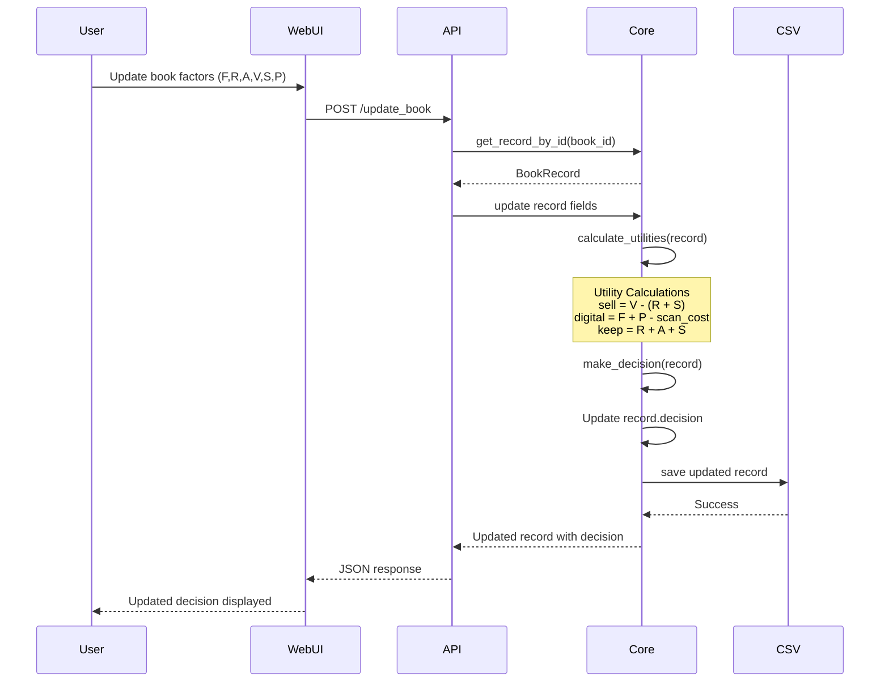
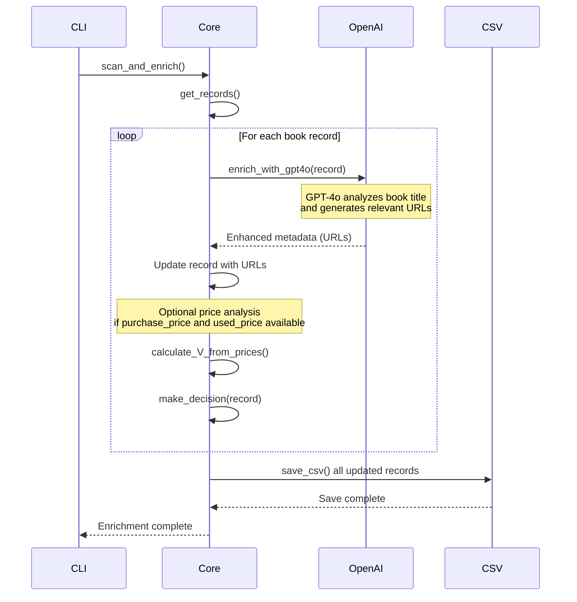
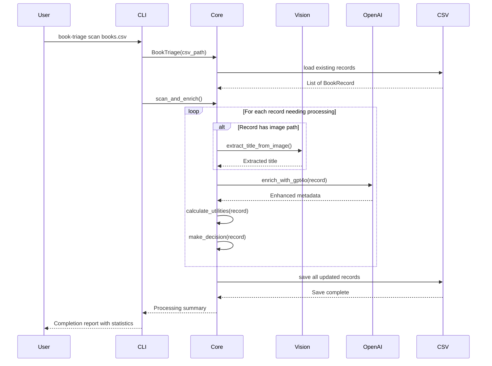
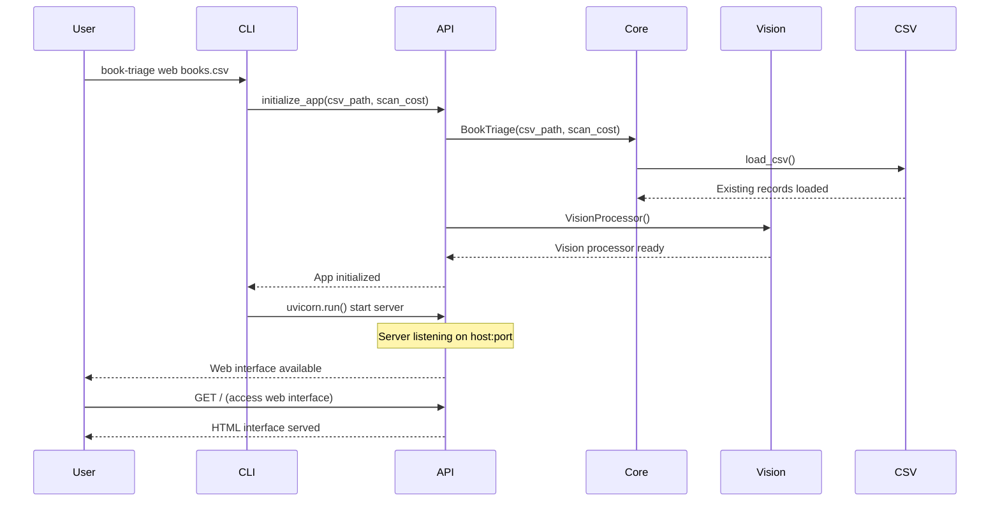
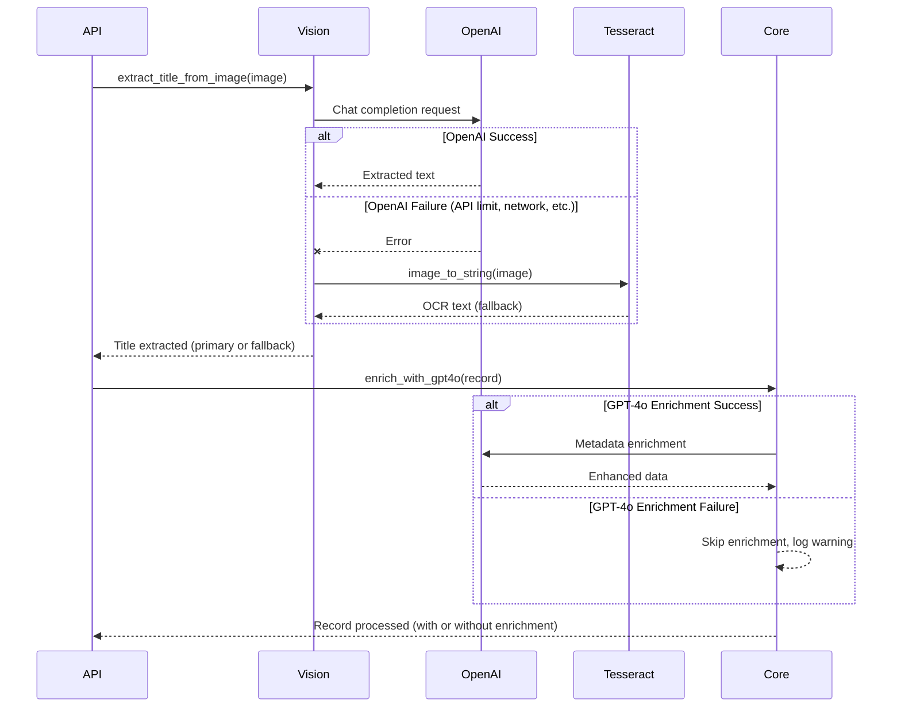

# Sequence Diagrams - Book Triage System

This document contains sequence diagrams showing the key interaction flows and processes in the Book Triage application.

## 1. Book Photo Upload and Processing

This sequence shows the complete flow when a user uploads a book photo through the web interface.

## 2. Manual Title Addition

This sequence shows the workflow when a user manually adds a book title and ISBN.

## 3. Decision-Making Workflow

This sequence illustrates the utility-based decision making process for a book.

## 4. AI Enrichment Process

This sequence shows how the system enriches book records with AI-powered metadata.

## 5. CLI Batch Processing

This sequence shows the CLI workflow for batch processing books.

## 6. Web Interface Initialization

This sequence shows the startup process for the web interface.

## 7. Error Handling and Fallback

This sequence demonstrates the error handling and fallback mechanisms.

## Key Interaction Patterns

### 1. **Dual-Path Processing**
- Primary: OpenAI Vision API for high-quality extraction
- Fallback: Tesseract OCR for offline/backup processing

### 2. **Asynchronous Enrichment**
- AI enrichment happens independently of core functionality
- System remains functional even if AI services are unavailable

### 3. **Graceful Degradation**
- Each component has fallback mechanisms
- User experience maintained despite service failures

### 4. **Stateless Operations**
- Web API is stateless with data persistence in CSV
- CLI operations are atomic and can be repeated safely

### 5. **Security Integration**
- Authentication and validation occur early in request flow
- File sanitization prevents security vulnerabilities

These sequence diagrams illustrate the robust, fault-tolerant design of the Book Triage system with clear separation of concerns and multiple fallback strategies. 