# Use Case Diagram - Book Triage System

This use case diagram captures the system functionality from the user perspective, showing all actors, use cases, and their relationships.

```mermaid
graph TB
    %% Actors
    User((User))
    Admin((Admin))
    System((System))
    
    %% System Boundary
    subgraph "Book Triage System"
        %% Primary Use Cases
        UC1[Upload Book Photo]
        UC2[Add Manual Title]
        UC3[View Book List]
        UC4[Edit Book Details]
        UC5[Get Decision Recommendation]
        UC6[Export Book Data]
        UC7[Search Books]
        
        %% Admin Use Cases
        UC8[Batch Process Books]
        UC9[Configure System]
        UC10[View System Logs]
        UC11[Manage Authentication]
        
        %% System Use Cases
        UC12[Extract Text from Image]
        UC13[Enrich Book Metadata]
        UC14[Calculate Utilities]
        UC15[Make Decision]
        UC16[Validate Input]
        UC17[Authenticate User]
        
        %% Extended Use Cases
        UC18[Process with OpenAI Vision]
        UC19[Process with Tesseract OCR]
        UC20[Update Price Ratios]
        UC21[Generate Reports]
        UC22[Backup Data]
    end
    
    %% External Systems
    OpenAI_API((OpenAI API))
    Tesseract((Tesseract OCR))
    
    %% Actor-Use Case Relationships
    User --> UC1
    User --> UC2
    User --> UC3
    User --> UC4
    User --> UC5
    User --> UC6
    User --> UC7
    
    Admin --> UC8
    Admin --> UC9
    Admin --> UC10
    Admin --> UC11
    Admin --> UC1
    Admin --> UC2
    Admin --> UC3
    Admin --> UC4
    Admin --> UC5
    Admin --> UC6
    Admin --> UC7
    
    System --> UC12
    System --> UC13
    System --> UC14
    System --> UC15
    System --> UC16
    System --> UC17
    
    %% Include Relationships
    UC1 -.->|includes| UC12
    UC1 -.->|includes| UC16
    UC1 -.->|includes| UC17
    UC2 -.->|includes| UC16
    UC2 -.->|includes| UC17
    UC4 -.->|includes| UC14
    UC4 -.->|includes| UC15
    UC5 -.->|includes| UC14
    UC5 -.->|includes| UC15
    UC8 -.->|includes| UC13
    UC8 -.->|includes| UC14
    UC8 -.->|includes| UC15
    
    %% Extend Relationships
    UC18 -.->|extends| UC12
    UC19 -.->|extends| UC12
    UC20 -.->|extends| UC4
    UC21 -.->|extends| UC6
    UC22 -.->|extends| UC9
    
    %% External System Relationships
    UC18 --> OpenAI_API
    UC19 --> Tesseract
    UC13 --> OpenAI_API
    
    %% Styling
    classDef actor fill:#e1f5fe
    classDef usecase fill:#e8f5e8
    classDef system fill:#fff3e0
    classDef external fill:#ffebee
    
    class User,Admin,System actor
    class UC1,UC2,UC3,UC4,UC5,UC6,UC7,UC8,UC9,UC10,UC11 usecase
    class UC12,UC13,UC14,UC15,UC16,UC17,UC18,UC19,UC20,UC21,UC22 system
    class OpenAI_API,Tesseract external
```

## Use Case Descriptions

### Primary User Use Cases

#### UC1: Upload Book Photo
- **Actor**: User, Admin
- **Description**: Upload an image of a book cover or spine to extract title and ISBN
- **Preconditions**: User has access to the web interface
- **Main Flow**: 
  1. User drags/drops or selects image file
  2. System validates file format and size
  3. System extracts text using vision processing
  4. System creates new book record
  5. System displays extracted information
- **Includes**: UC12 (Extract Text), UC16 (Validate Input), UC17 (Authenticate)

#### UC2: Add Manual Title
- **Actor**: User, Admin
- **Description**: Manually enter book title and ISBN without photo upload
- **Preconditions**: User has access to the system
- **Main Flow**:
  1. User enters title and ISBN in form
  2. System validates input format
  3. System creates book record
  4. System optionally enriches metadata
  5. System confirms creation
- **Includes**: UC16 (Validate Input), UC17 (Authenticate)

#### UC3: View Book List
- **Actor**: User, Admin
- **Description**: Display all books in the database with current status
- **Preconditions**: User has access to the system
- **Main Flow**:
  1. User requests book list
  2. System retrieves all records
  3. System displays formatted table
  4. System shows decision status for each book

#### UC4: Edit Book Details
- **Actor**: User, Admin
- **Description**: Modify book metadata and utility factors
- **Preconditions**: Book record exists
- **Main Flow**:
  1. User selects book to edit
  2. User modifies fields (F, R, A, V, S, P)
  3. System validates input ranges
  4. System recalculates utilities
  5. System updates decision
  6. System saves changes
- **Includes**: UC14 (Calculate Utilities), UC15 (Make Decision)
- **Extends**: UC20 (Update Price Ratios)

#### UC5: Get Decision Recommendation
- **Actor**: User, Admin
- **Description**: Get system recommendation for what to do with a book
- **Preconditions**: Book has sufficient metadata
- **Main Flow**:
  1. User requests decision for book
  2. System calculates utility scores
  3. System determines optimal decision
  4. System displays recommendation with reasoning
- **Includes**: UC14 (Calculate Utilities), UC15 (Make Decision)

#### UC6: Export Book Data
- **Actor**: User, Admin
- **Description**: Export book database to CSV format
- **Preconditions**: Books exist in database
- **Main Flow**:
  1. User requests data export
  2. System formats data for export
  3. System generates CSV file
  4. System provides download link
- **Extends**: UC21 (Generate Reports)

#### UC7: Search Books
- **Actor**: User, Admin
- **Description**: Search for specific books by title, author, or other criteria
- **Preconditions**: Books exist in database
- **Main Flow**:
  1. User enters search criteria
  2. System filters book list
  3. System displays matching results

### Administrative Use Cases

#### UC8: Batch Process Books
- **Actor**: Admin
- **Description**: Process multiple books at once using CLI interface
- **Preconditions**: Admin has CLI access and CSV file
- **Main Flow**:
  1. Admin runs scan command
  2. System processes all records
  3. System enriches metadata
  4. System calculates decisions
  5. System saves updated data
  6. System reports statistics
- **Includes**: UC13 (Enrich Metadata), UC14 (Calculate Utilities), UC15 (Make Decision)

#### UC9: Configure System
- **Actor**: Admin
- **Description**: Configure system settings and parameters
- **Preconditions**: Admin privileges
- **Main Flow**:
  1. Admin accesses configuration
  2. Admin modifies settings
  3. System validates configuration
  4. System applies changes
- **Extends**: UC22 (Backup Data)

#### UC10: View System Logs
- **Actor**: Admin
- **Description**: Monitor system operation and troubleshoot issues
- **Preconditions**: Admin privileges
- **Main Flow**:
  1. Admin requests log access
  2. System displays log entries
  3. Admin reviews for errors/warnings

#### UC11: Manage Authentication
- **Actor**: Admin
- **Description**: Configure user authentication and access control
- **Preconditions**: Admin privileges
- **Main Flow**:
  1. Admin manages credentials
  2. System updates authentication settings
  3. System applies new security rules

### System Use Cases

#### UC12: Extract Text from Image
- **Actor**: System
- **Description**: Process uploaded images to extract book information
- **Extended by**: UC18 (OpenAI Vision), UC19 (Tesseract OCR)

#### UC13: Enrich Book Metadata
- **Actor**: System
- **Description**: Use AI to enhance book records with additional information
- **External Dependency**: OpenAI API

#### UC14: Calculate Utilities
- **Actor**: System
- **Description**: Compute utility scores for sell, digital, and keep options
- **Algorithm**: 
  - Sell: V - (R + S)
  - Digital: F + P - scan_cost
  - Keep: R + A + S

#### UC15: Make Decision
- **Actor**: System
- **Description**: Determine optimal decision based on utility calculations

#### UC16: Validate Input
- **Actor**: System
- **Description**: Ensure all user inputs meet system requirements and constraints

#### UC17: Authenticate User
- **Actor**: System
- **Description**: Verify user credentials and authorize access

## Extension Use Cases

#### UC18: Process with OpenAI Vision
- **Description**: Primary image processing using OpenAI's GPT-4o Vision API
- **Extends**: UC12
- **Dependency**: OpenAI API availability

#### UC19: Process with Tesseract OCR
- **Description**: Fallback image processing using local Tesseract OCR
- **Extends**: UC12
- **Dependency**: Tesseract installation

#### UC20: Update Price Ratios
- **Description**: Calculate resale value (V) based on price ratios
- **Extends**: UC4
- **Formula**: V = f(used_price / purchase_price)

#### UC21: Generate Reports
- **Description**: Create detailed analytics and reports from book data
- **Extends**: UC6

#### UC22: Backup Data
- **Description**: Create backup copies of book database
- **Extends**: UC9

## Key Relationships

### Include Relationships
- **Authentication**: Most user-facing use cases include authentication
- **Validation**: Input-related use cases include validation
- **Decision Logic**: Editing and recommendation use cases include utility calculations

### Extend Relationships
- **Vision Processing**: Multiple strategies extend basic text extraction
- **Enhanced Features**: Advanced features extend basic functionality
- **Administrative Tools**: Management features extend basic operations

### Actor Inheritance
- **Admin extends User**: Admins can perform all user functions plus administrative tasks
- **System Actor**: Represents automated system processes

This use case model provides a comprehensive view of the Book Triage system functionality, clearly separating user-facing features from system-internal processes and showing the relationships between different capabilities. 